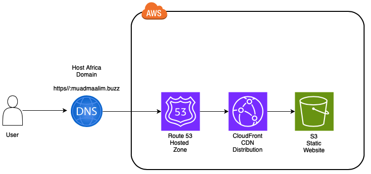

# My AWS Cloud Resume Project

## Introduction
This project aims to host a static website on AWS using services such as S3, CloudFront, and Route 53. The website hosts my resume written in HTML and styled with CSS.

## Step-by-Step Guide

### 1. Review the Challenge Requirements
Setting Up CloudFront: Configuring CloudFront to properly distribute the content and handle HTTPS.

DNS Configuration: Ensuring the domain name pointed correctly to the CloudFront distribution.

### 2. Building Architecture Diagram

### 3. HTML and CSS
resume.html file

### 4. Deploy Static Website on Amazon S3
https://myi-95-resume.s3.amazonaws.com/resume.html

### 5. Enable HTTPS with Amazon CloudFront
Coming Soon...

### 6. Set Up Custom Domain with Route 53
personal Domain Link: resume.mm.buzz

### 7. Document Progress
Step 1: Set Up Your S3 Bucket for Static Website Hosting

Create an S3 Bucket:

Open the Amazon S3 console.

Create a new bucket or use an existing bucket.

Name the bucket the same as your domain (e.g., example.com). in my case I did not use same bucket name as domain but its optional

Enable Static Website Hosting:

Go to your S3 bucket.

Click on the "Properties" tab.

Click on "Static website hosting" and choose "Use this bucket to host a website."

Specify the index document (e.g., resume.html).

Set Permissions:

Go to the "Permissions" tab.

Click on resume.html and on Properties you have access to your static website on Object URL.

SSL Certificate: Coming Soon

CloudFront: Coming Soon

## Challenges Faced
Learned that in some cases, it can take up to 24 hours for domain activation and propagation to complete, which took my project more time to complete. 

That's why part of the project is still pending (Coming Soon) as soon as my Domain is Active worldwide.

## Key Takeaways
Understanding AWS Services: Gained a deeper understanding of how S3, CloudFront, and Route 53 work together.

Security: Learned the importance of HTTPS and how to implement it using CloudFront.

New tools: Learned how to use external Host domain platform in my case I used http://hostafrica.ke

## Resources
- AWS Documentation:

S3 Static website: 
https://docs.aws.amazon.com/AmazonS3/latest/userguide/HostingWebsiteOnS3Setup.html

Route 53: 
https://docs.aws.amazon.com/Route53/latest/DeveloperGuide/getting-started-cloudfront-overview.html

Cloutfront: 
https://medium.com/@christemenike/aws-s3-static-website-with-cloudfront-b891c86cc19

## Live Website
https://myi-95-resume.s3.amazonaws.com/resume.html

personal Domain Link: 
www.resume.yourdomain.buzz
